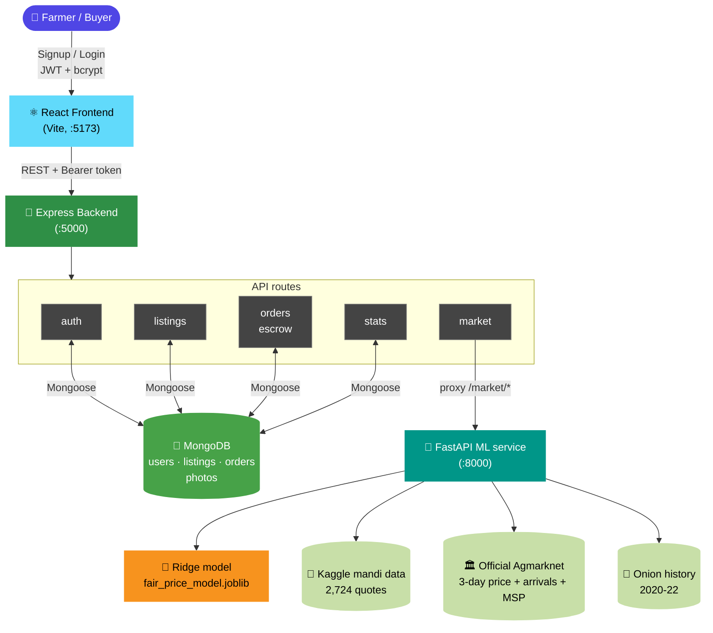
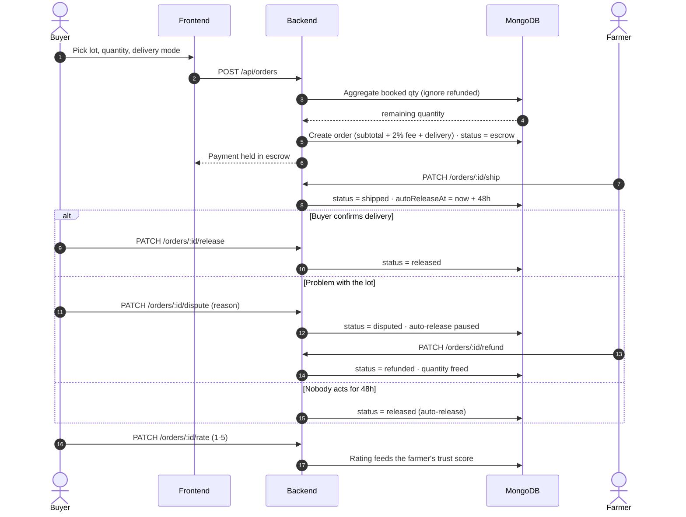
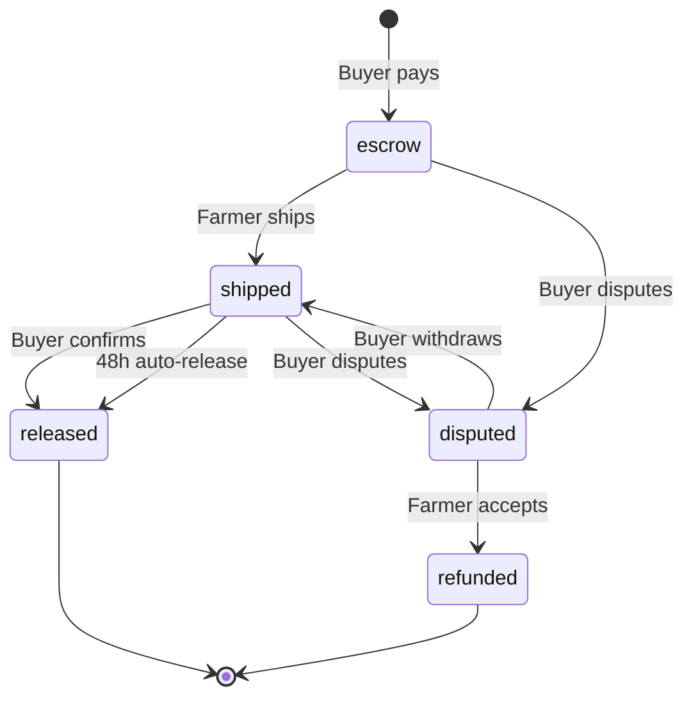
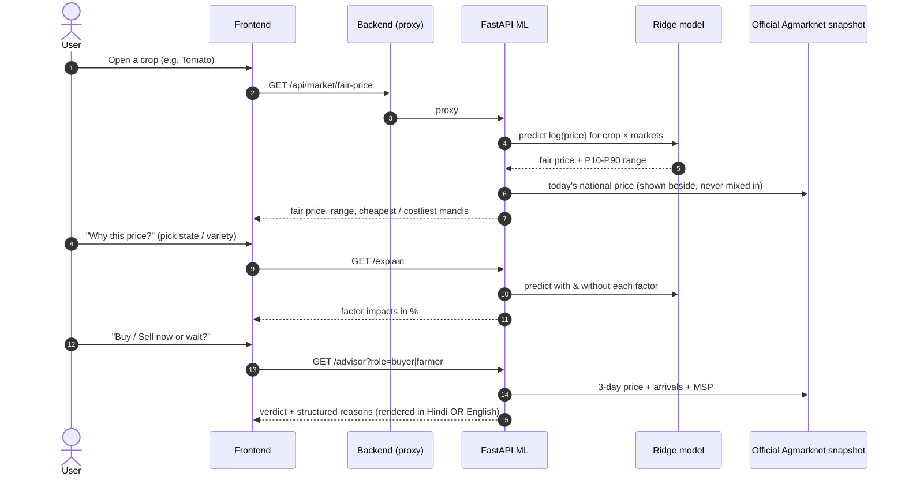
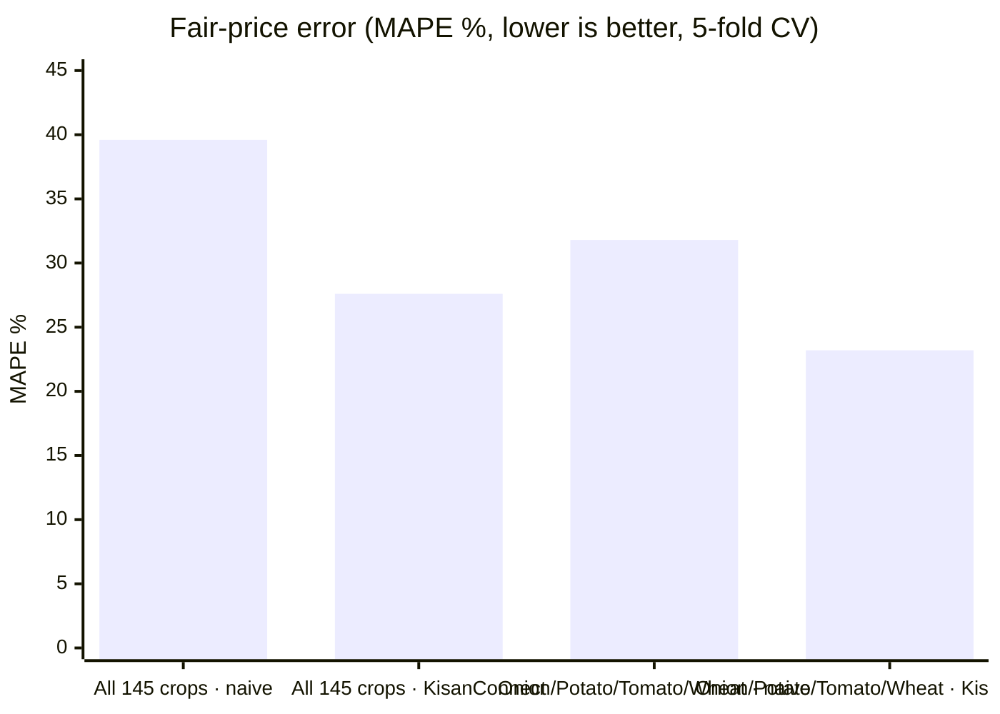

<div align="center">

# 🌾 KisanConnect

### Direct Farmer, Direct Profit

**An AI-powered, escrow-secured marketplace that connects farmers directly to bulk buyers — no middlemen.**
List a crop lot → pool buyers → pay into escrow → deliver → release. With an honest AI fair-price engine and official Agmarknet data on top.


[]()

</div>

---

## 📖 Overview

KisanConnect is a full-stack marketplace built for **Innohacks 4.0**. A farmer lists a crop lot; small shops, caterers and societies **pool their orders** to fill it; payment is held in **escrow** until delivery is confirmed; and an **AI model + official government price data** keep every price fair and visible.

> The mandi chain today is *Farmer → Village agent → Mandi trader → Transporter → Retailer → Buyer*. KisanConnect collapses **5 middleman hops into 1 trust layer.**

It isn't a thin CRUD app — every core feature is backed by a real algorithm or data pipeline:

| Feature | What's actually happening under the hood |
|---|---|
| 🤖 **AI Fair Price** | Ridge regression on one-hot(state, district, market, crop, variety, grade) → `log(modal price)`, trained on **2,724 real mandi quotes** (145 crops, 16 states), validated with **5-fold CV** against a naive baseline |
| 🔍 **"Why this price?"** | Ablation on the model: re-predicts with each chosen factor blanked out and reports the % it moves the estimate — explainable, not a black box |
| 📈 **Buy / Sell now or wait?** | Transparent rules on 3 days of **official Agmarknet** price + arrival data, **role-aware** (buyers get *Buy now / Wait*, farmers get *Sell now / Wait*) — a signal, not a forecast |
| 🏛 **MSP check** | Compares the farmer's asking rate with the official **MSP 2026-27** while listing |
| 💰 **Savings Simulator** | Farmer's net ₹ via KisanConnect vs the mandi route (official national price − editable commission & transport assumptions) |
| 🔒 **Escrow + disputes** | Order state machine: `escrow → shipped → released`, with `disputed → refunded` and a **48 h auto-release** timer; full order timeline |
| 👥 **Group buying** | Mongo aggregation sums quantities across buyers so many small orders fill one large lot (refunded orders free their quantity back) |
| ⏳ **Freshness countdown** | Harvest date + approx. shelf life → days-left bar, *Sell soon* badge, "Expiring soon" sort |
| 🎙️ **Voice listing** | Browser speech recognition + a parser that understands *"onion fifty quintal eighteen hundred rupees Meerut"* (incl. Hindi number-words) and fills the whole form |
| ⭐ **Kisan Credit Score** | Explainable 300–850 **trust** score (`300 + orders×10 + rating×60 + volume bonus`) — not a loan score |
| 🌍 **Impact dashboard** | Live totals (farmers, buyers, listings, GMV) aggregated straight from MongoDB |
| 🗺️ **QR Mandi Poster** | Every lot gets a printable QR that opens that exact listing |

---

## 💻 Tech Stack

| Layer | Technology |
|---|---|
| Frontend | React 18 (Vite), Hindi + English i18n, mobile-first UI |
| Backend | Node.js, Express |
| Database | MongoDB (Atlas free tier) + Mongoose |
| Auth | JWT, bcryptjs |
| ML service | Python, FastAPI, scikit-learn (Ridge), pandas, joblib |
| Data | Kaggle Agmarknet mandi quotes · Official Agmarknet national report (Oct 2026) · Onion history 2020-22 |
| Hosting | Render free tier (2 services) — **zero paid APIs** |

---

## 🏗️ Architecture



### Escrow order flow



### Order state machine



### AI fair-price & advisor pipeline



---

## 📊 Model results

Honest, measured, cross-validated (`ml-service/artifacts/metrics.json`):



| Scope | Naive baseline | KisanConnect (Ridge) | Improvement |
|---|---|---|---|
| All 145 crops | 39.6 % | **27.6 %** | −12.0 pts |
| Onion · Potato · Tomato · Wheat | 31.8 % | **23.2 %** | −8.6 pts |

---

## 🗃️ Data sources

| File | Source | Rows | Date | Used for |
|---|---|---|---|---|
| `data/commodity_price.csv` | Kaggle — Daily Wholesale Commodity Prices (Agmarknet), mandi-level | 2,733 | 19 May 2025 (single day) | Trains the fair-price model, state comparison |
| `data/national_snapshot.json` | Official Agmarknet *Marketwise Price & Arrival* report | 25 crops × 3 days | 30 Sep – 2 Oct 2026 | MSP check, buy/sell advisor, savings simulator |
| `data/onion_history_summary.json` | Open GitHub dataset `amitkaps/onions-dataset` | 30,959 | 2020 – 2022 | Onion seasonality context |

More detail and refresh steps: [`data/DATA_README.md`](data/DATA_README.md).

---

## ✨ Features

**For farmers** — voice / form listing with photo & harvest date · MSP and national-price hint while listing · AI fair price + "Why this price?" · Sell-now-or-wait signal · Savings simulator · incoming orders with timeline · accept-refund on disputes · Kisan Credit Score · QR poster per lot

**For buyers** — marketplace with search, crop filter and sort (newest / price / expiring soon) · deal badges per listing · group buying · pickup / truck / society hub / cold hub delivery · escrow payment · dispute or confirm · rate farmers · Buy-now-or-wait signal

**Accounts** — signup with a recovery PIN · **Forgot password?** (phone + PIN, no paid SMS/e-mail needed) · change password / recovery PIN from the profile menu · login throttling · error messages in your language

**For everyone** — 100 % Hindi **or** 100 % English UI · phone-first layout with bottom tabs · profile menu (language + logout) · Back button moves between tabs and closes popups · photos stored in MongoDB so they survive redeploys

---

## 📁 Project Structure

```
kisanconnect/
├── frontend/                  React app (Vite)
│   └── src/
│       ├── App.jsx            tab routing + browser-history (Back) handling
│       ├── api.js             fetch wrapper + client-side photo compression
│       ├── i18n.js            Hindi/English strings, crop & state names
│       ├── voiceParse.js      spoken sentence → listing form
│       ├── useFairPrice.js    deal-badge logic
│       ├── context/           Auth, Lang, Toast
│       └── components/        FarmerDashboard, BuyerDashboard, MarketAdvisor,
│                              FairPriceModal, OrderExtras (timeline, dispute),
│                              CreditScore, CompareChart, ProductCard, TopNav …
├── backend/                   Express API (Node.js)
│   ├── server.js              app + static React build
│   ├── config.js              fee, delivery modes, auto-release window, shelf-life
│   ├── seed.js                demo users, lots and 3 orders (released / escrow / disputed)
│   ├── middleware/auth.js     JWT verification
│   ├── models/                User · Listing · Order
│   └── routes/                auth · listings · orders · market · stats
├── ml-service/                Python FastAPI service
│   ├── main.py                fair-price · explain · advisor · benchmark · savings data
│   ├── train.py               trains + cross-validates the Ridge model
│   └── artifacts/             fair_price_model.joblib · metrics.json
├── data/                      all datasets + DATA_README.md
├── render.yaml                two-service Render blueprint
└── README.md
```

---

## 🚀 Getting Started

### Prerequisites
- Node.js **18+**
- Python **3.10+**
- A MongoDB database — free [MongoDB Atlas](https://www.mongodb.com/atlas) or local `mongodb://127.0.0.1:27017/kisanconnect`

### 1. ML service
```bash
cd ml-service
pip install -r requirements.txt
python train.py                  # optional: retrain from ../data/commodity_price.csv
uvicorn main:app --port 8000
```

### 2. Backend
```bash
cd backend
cp .env.example .env             # fill MONGO_URI and JWT_SECRET
npm install
node seed.js                     # demo accounts + lots + orders
npm start                        # http://localhost:5000
```

### 3. Frontend
```bash
cd frontend
npm install
npm run dev                      # http://localhost:5173 (proxies /api to :5000)
# production: npm run build  → the backend serves frontend/dist automatically
```

**Demo login:** any phone printed by `seed.js` + password `demo1234` (recovery PIN for *Forgot password?* is `1234`).

### Environment variables (`backend/.env`)

| Variable | Purpose | Default |
|---|---|---|
| `MONGO_URI` | MongoDB connection string | — |
| `JWT_SECRET` | Signs login tokens | — |
| `PORT` | Backend port | `5000` |
| `ML_SERVICE_URL` | URL of the Python ML service | `http://localhost:8000` |
| `AUTO_RELEASE_MINUTES` | Escrow auto-release window after shipping | `2880` (48 h) — set `2` for a live demo |
| `KEEP_ALIVE` | `auto` (default on Render) pings the backend + ML service every 8 min inside the daily window · `false` turns it off | `auto` |
| `KEEP_ALIVE_HOURS` | Daily keep-alive window in IST — `0-24` for judging day | `9-21` |

### ☁️ Deploy on Render (free)
1. Push to GitHub → Render **New → Blueprint** (uses `render.yaml`) — it creates **two** web services: `kisanconnect` (Node) and `kisanconnect-ml` (Python).
2. On the Node service set `MONGO_URI`, `JWT_SECRET` and **`ML_SERVICE_URL=https://<your-ml-service>.onrender.com`**.
3. Free instances sleep after ~15 min idle. KisanConnect handles this for you: the site pre-warms the ML service on open, the backend **retries for ~55 s** while it wakes (users see a calm "AI service is waking up…" message, not an error), and the backend pings the ML service every 10 min while it is awake.
4. **Keep-alive is built in:** on Render the backend pings itself (and, through `/api/market/warm`, the ML service) every 8 min **between 09:00-21:00 IST**, so both stay awake all day. **Judging day:** set `KEEP_ALIVE_HOURS=0-24`. Optional: a free [UptimeRobot](https://uptimerobot.com) monitor on `https://<your-app>.onrender.com/api/market/warm` (every 5 min) wakes everything even before the first visitor. Keeping both services awake all day uses a lot of the free monthly instance-hours — check your Render dashboard and narrow the window if needed.

---

## 🔌 API Reference (JWT-protected unless noted)

| Method | Endpoint | Description |
|---|---|---|
| POST | `/api/auth/signup` · `/api/auth/login` | Register (with a 4-6 digit **recovery PIN**) / login (farmer or buyer) |
| POST | `/api/auth/forgot` *(public)* | Reset password with phone + recovery PIN (5 wrong tries → 15-min lock) |
| POST | `/api/auth/change-password` · `/api/auth/recovery` | Change password · set/change recovery PIN (logged in) |
| GET / POST | `/api/listings` | Marketplace lots (with freshness) · create a lot (+ photo) |
| GET | `/api/listings/mine` · `/:id` · `/:id/qr` | Farmer's lots · one lot · QR poster |
| GET | `/api/listings/:id/photo` *(public)* | Lot photo served from MongoDB |
| PATCH | `/api/listings/:id/close` | Close a lot |
| POST | `/api/orders` | Place order → money held in escrow |
| GET | `/api/orders/mine` | My orders (also triggers due auto-releases) |
| PATCH | `/api/orders/:id/{ship, release, dispute, withdraw, refund, rate}` | Escrow lifecycle |
| GET | `/api/market/{fair-price, explain, compare, top-markets, spread, crops, states}` | AI price & mandi analytics |
| GET | `/api/market/{benchmark, advisor, onion-history, savings, intelligence}` | Official-data features |
| GET | `/api/stats/impact` | Live platform totals |

---

## 🎬 2-minute demo flow
1. **Farmer:** say *"Onion fifty quintal eighteen hundred rupees Meerut"* → form fills → MSP / national-price hint appears.
2. **Dashboard:** *Sell now or wait?* → **Savings Simulator** shows the extra ₹ vs the mandi route.
3. **Mandi tab:** open a crop → **Why this price?** → pick a state.
4. **Buyer:** marketplace → *Sell soon · 2d left* badge → group-buy → money goes to escrow.
5. **Orders:** farmer ships → buyer disputes → farmer accepts refund (or wait for auto-release).

---

## ⚠️ Honest limitations
- The fair-price model is trained on a **single-day** mandi snapshot (19 May 2025) → it estimates a *fair rate*, it does **not** forecast. Today's official national price is shown beside it, never blended in.
- The Oct-2026 report is **national-level**, not per-mandi; the buy/sell signal uses only 3 days of data and simple rules.
- Escrow / payment is **simulated** (no gateway). Next step: Razorpay / Cashfree test mode.
- Savings-simulator commission/transport and shelf-life values are **editable assumptions**, clearly labelled in the UI.
- Dispute resolution is buyer ⇄ farmer; a platform arbitrator is future work.

## 🗺️ Roadmap
| Now | Next | 6 months | 1 year |
|---|---|---|---|
| Free-tier MVP, simulated escrow | Real payments (Razorpay/Cashfree), daily Agmarknet feed | UP mandis, SMS/WhatsApp alerts, cold-storage tie-ups | Multi-state, truck partner network, price forecasting |

---

<div align="center">

### Built for **Innohacks 4.0** by Team **Code Hunters**

**Ujjwal Sharma** (Team Lead) · Aastha · Aanya · Nishita


[](https://github.com/ujjwalsharma25)

⭐ *If this project helped you, consider giving it a star!*

</div>
