<div align="center">

# 🌾 KisanConnect

### AI decision support for Indian farmers

**Crop and fertilizer recommendations, leaf-photo disease detection, yield prediction, weather advisories, live mandi prices, government scheme lookup, a farm-input marketplace and a multilingual agricultural assistant. One Flask app, running on a laptop or a single dyno.**


[](LICENSE)
[](https://kisanconnect-1-3bbk.onrender.com)

</div>

---

## 📑 Table of Contents

- [Overview](#-overview)
- [Credits and Upstream Project](#-credits-and-upstream-project)
- [Screenshots](#-screenshots)
- [Architecture](#️-architecture)
- [Feature Flows](#-feature-flows)
- [Database Design](#️-database-design)
- [What's Inside](#-whats-inside)
- [Reference Results](#-reference-results)
- [Model Weights](#-model-weights)
- [Getting Started](#-getting-started)
- [The Assistant](#-the-assistant)
- [Project Layout](#-project-layout)
- [Tests and Deployment](#-tests-and-deployment)
- [Future Scope](#-future-scope)
- [License](#-license)
- [Team](#-team)
- [Disclaimer](#️-disclaimer)

---

## 📖 Overview

KisanConnect is a farmer-first, AI-powered decision support platform built by **Team Code Hunters**. A farmer can pick a crop, get a fertilizer plan, check a leaf for disease, estimate yield, see the weather, look up mandi prices and government schemes, buy inputs, and ask questions in plain language, all from one web app.

Every feature is backed by a real model, rule or data source, and the app is honest about uncertainty (prediction intervals, confidence tiers, "rule first, model second" fertilizer logic).

| Area | What it does |
|---|---|
| 🌱 **Crop recommendation** | Soil N, P, K, pH and climate in, top-3 crops out with probabilities and indicative economics |
| 🧪 **Fertilizer advice** | Rule-first nutrient plan from soil test and crop, plus a kg-and-bags dose calculator |
| 🍃 **Disease detection** | Upload a leaf photo, get condition, confidence, prevention steps and matching products |
| 📈 **Yield prediction** | Tonnes per hectare with a prediction interval and a regional median baseline |
| 🌦️ **Weather** | 7-day forecast, soil moisture and rule-based agro-advisories |
| 💰 **Mandi prices** | Live Agmarknet prices with MSP fallback |
| 🏛️ **Schemes and calendar** | 16 central schemes, sowing/harvest calendar, crop guides, pest management |
| 🛒 **Marketplace** | Seeded product catalogue, cart, checkout (COD/UPI), order tracking |
| 🤖 **Assistant** | Chat with tool use over every service above, Hindi/Hinglish support |
| 🛠️ **Admin** | Farmer verification, orders, catalogue, activity audit, chat logs, labelling queue |


---

## 🖼️ Screenshots

| | |
|---|---|
| 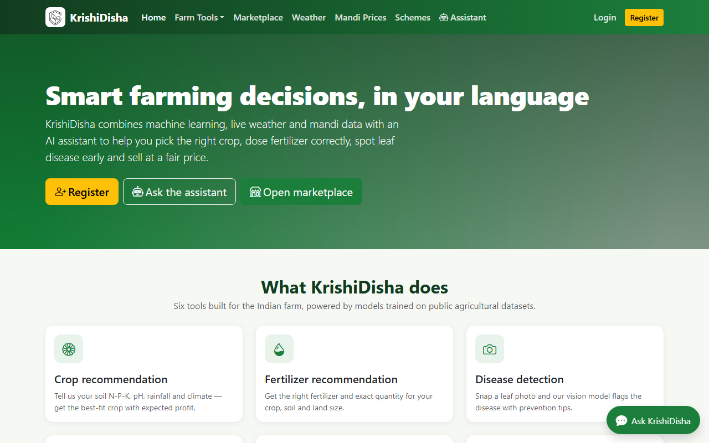 <br> Landing page: six tools, one assistant | 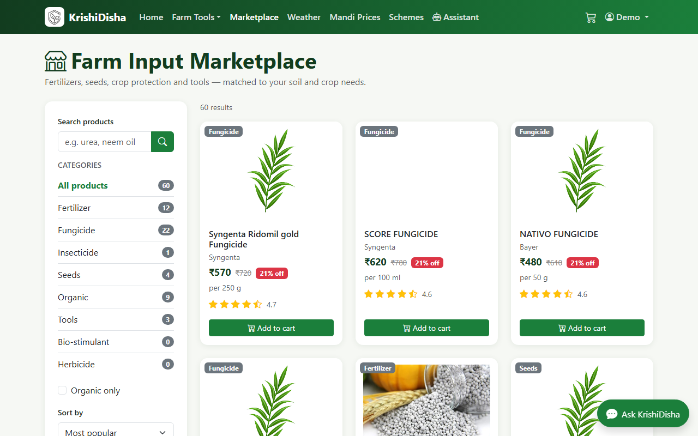 <br> Marketplace with seeded fertilizer, crop-protection and seed products |
| 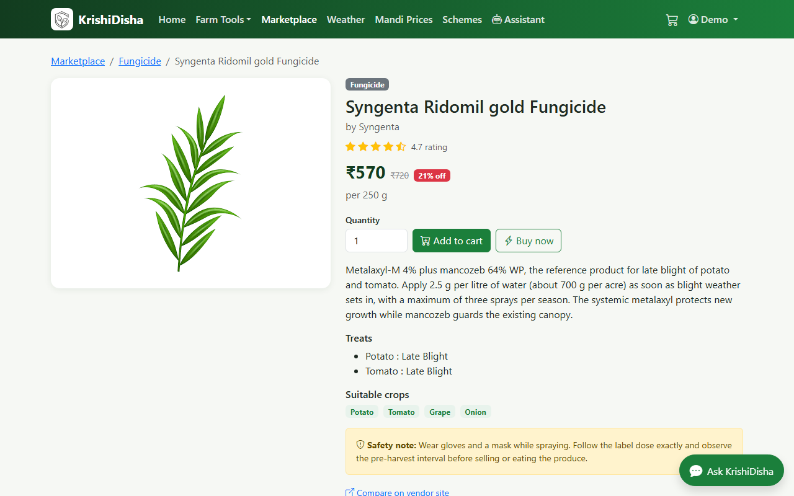 <br> Product detail with rating and add-to-cart | 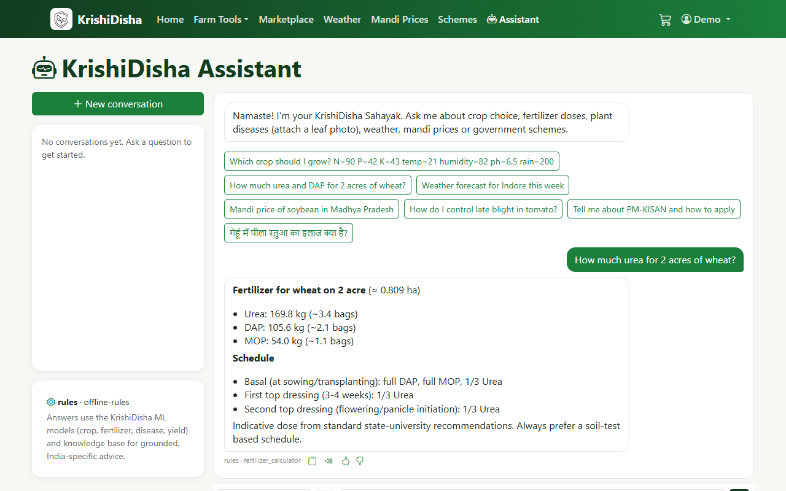 <br> Assistant answering a fertilizer-dose question with the calculator tool |
| 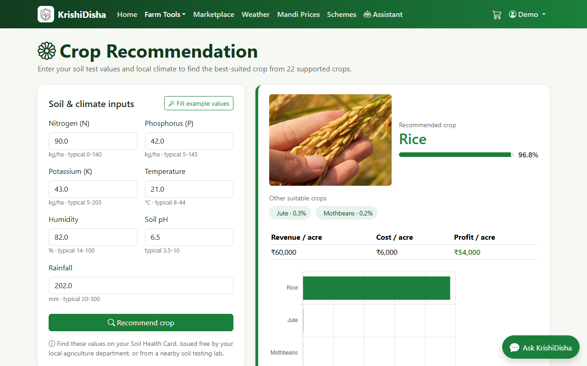 <br> Crop recommendation from soil N-P-K, pH, climate | 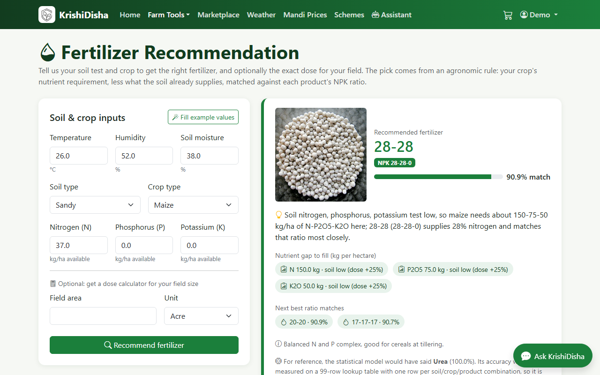 <br> Fertilizer pick from soil-test nutrient deficit |
| 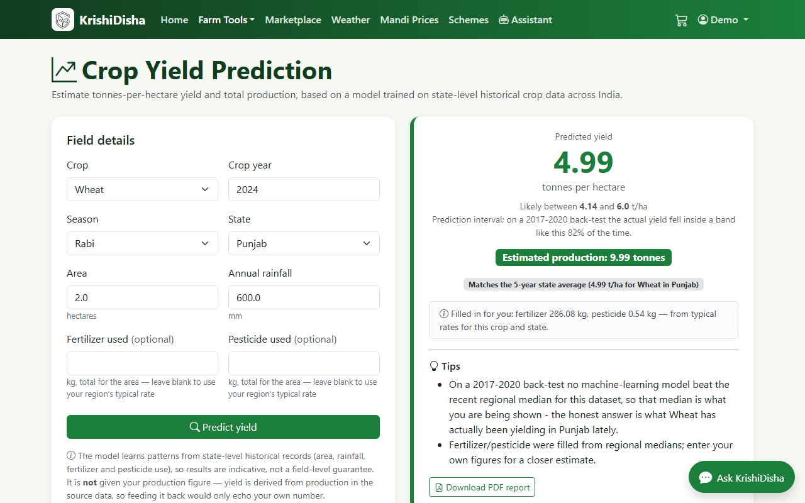 <br> Yield prediction with a prediction band | 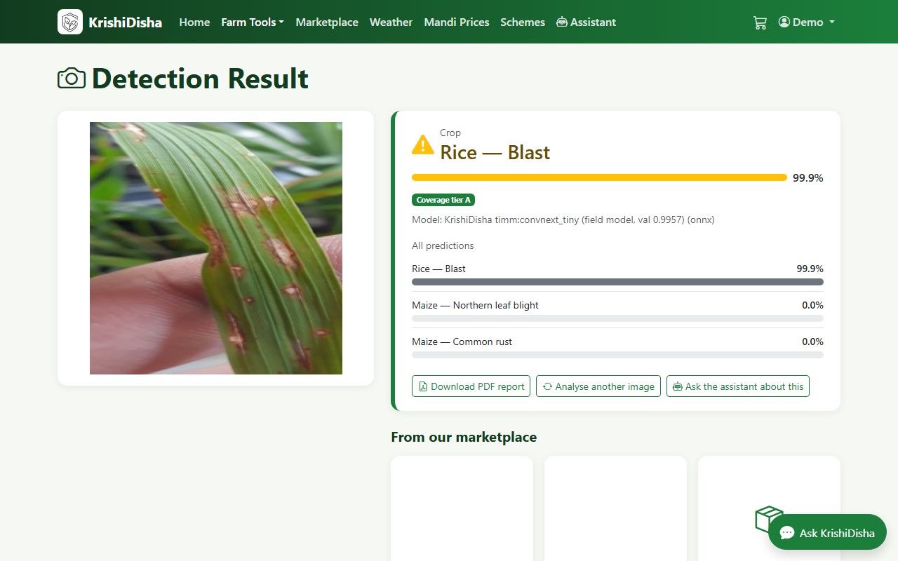 <br> Disease detection on a field photo |
| 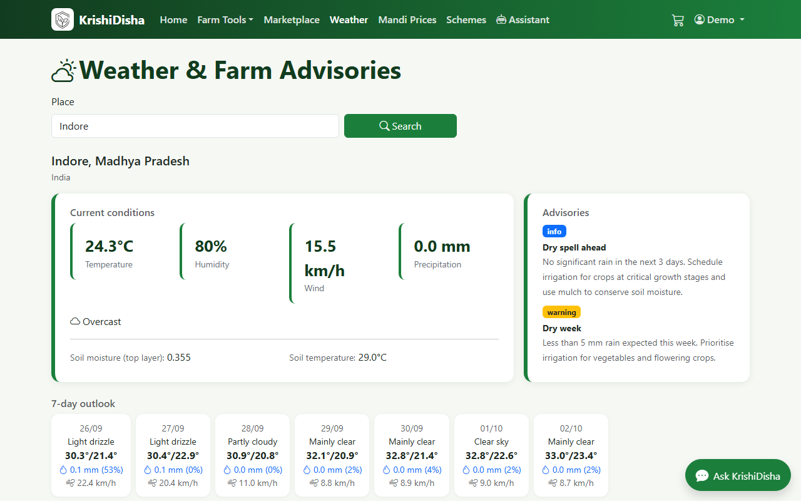 <br> 7-day forecast and agro-advisories | 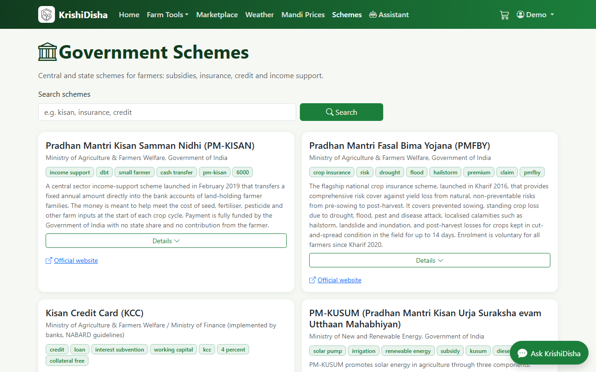 <br> Central scheme lookup with eligibility and links |
| 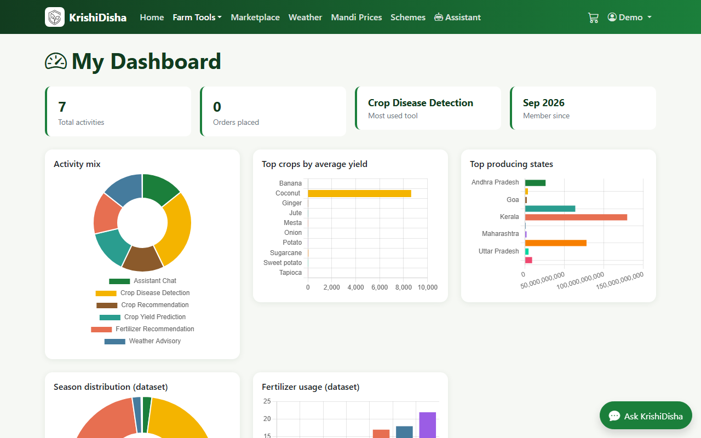 <br> A farmer's own activity and regional charts | 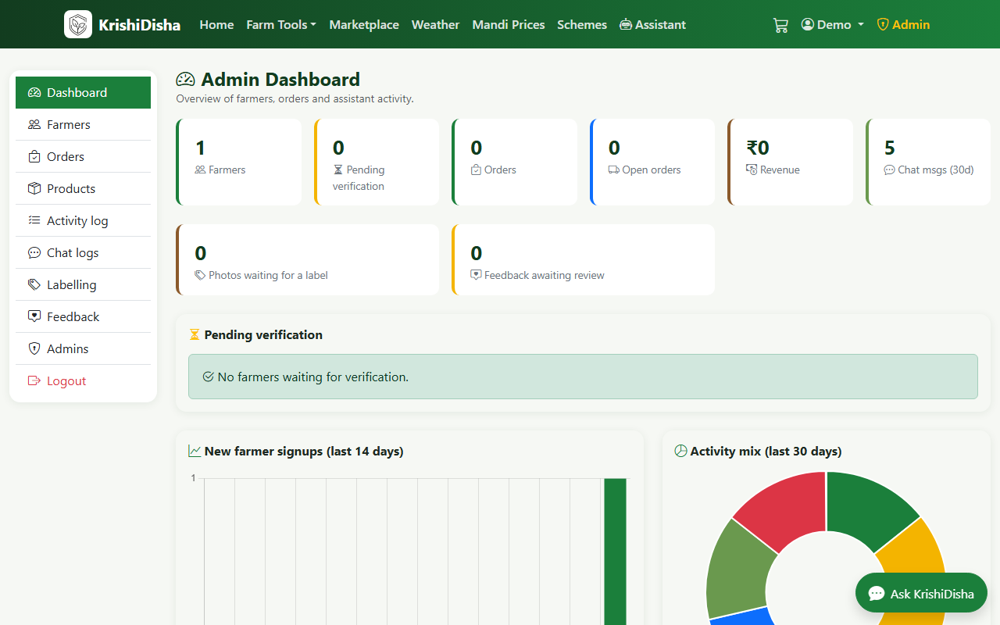 <br> Admin console: farmers, orders, activity, chat logs |

---

## 🏗️ Architecture

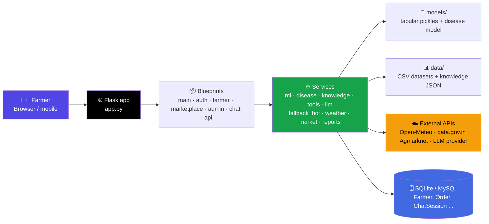
```mermaid
flowchart LR
    F["👨‍🌾 Farmer<br/>Browser / mobile"] --> Flask["🌐 Flask app<br/>app.py"]
    Flask --> BP["📦 Blueprints<br/>main · auth · farmer · marketplace · admin · chat · api"]
    BP --> SVC["⚙️ Services<br/>ml · disease · knowledge · tools · llm<br/>fallback_bot · weather · market · reports"]
    SVC --> Models["🧠 models/<br/>tabular pickles + disease model"]
    SVC --> Data["📊 data/<br/>CSV datasets + knowledge JSON"]
    SVC --> Ext["☁️ External APIs<br/>Open-Meteo · data.gov.in Agmarknet · LLM provider"]
    SVC --> DB[("🗄️ SQLite / MySQL<br/>Farmer, Order, ChatSession ...")]

    style F fill:#4f46e5,color:#fff
    style Flask fill:#000,color:#fff
    style SVC fill:#16a34a,color:#fff
    style DB fill:#4169e1,color:#fff
    style Ext fill:#f59e0b,color:#000
```

### Farmer journey

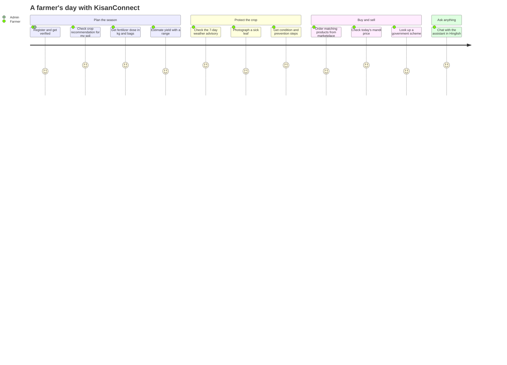
```mermaid
journey
    title A farmer's day with KisanConnect
    section Plan the season
      Register and get verified: 4: Farmer, Admin
      Check crop recommendation for my soil: 5: Farmer
      Get fertilizer dose in kg and bags: 5: Farmer
      Estimate yield with a range: 4: Farmer
    section Protect the crop
      Check the 7-day weather advisory: 5: Farmer
      Photograph a sick leaf: 4: Farmer
      Get condition and prevention steps: 5: Farmer
    section Buy and sell
      Order matching products from marketplace: 4: Farmer
      Check today's mandi price: 5: Farmer
      Look up a government scheme: 4: Farmer
    section Ask anything
      Chat with the assistant in Hinglish: 5: Farmer
```

---

## 🔄 Feature Flows

### Crop recommendation

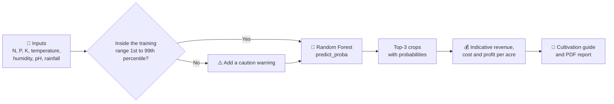
```mermaid
flowchart LR
    A["🧾 Inputs<br/>N, P, K, temperature,<br/>humidity, pH, rainfall"] --> B{"Inside the training<br/>range 1st to 99th percentile?"}
    B -->|"No"| W["⚠️ Add a caution warning"]
    B -->|"Yes"| C["🌲 Random Forest<br/>predict_proba"]
    W --> C
    C --> D["Top-3 crops<br/>with probabilities"]
    D --> E["💰 Indicative revenue,<br/>cost and profit per acre"]
    E --> F["📄 Cultivation guide<br/>and PDF report"]
```

### Fertilizer recommendation (rule first, model second)

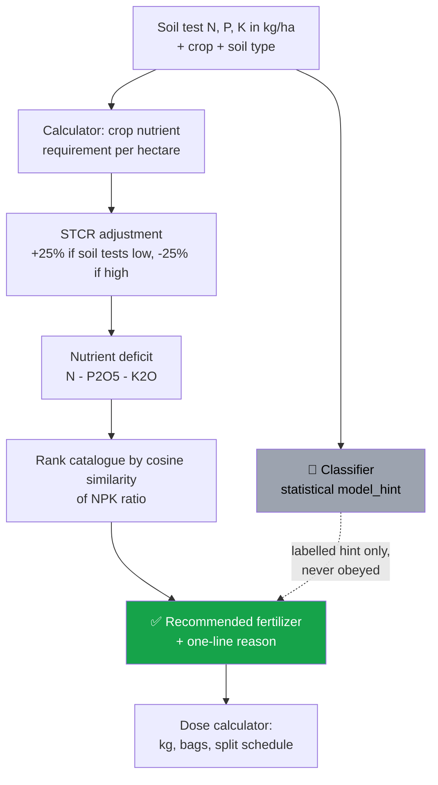
```mermaid
flowchart TD
    A["Soil test N, P, K in kg/ha<br/>+ crop + soil type"] --> B["Calculator: crop nutrient<br/>requirement per hectare"]
    B --> C["STCR adjustment<br/>+25% if soil tests low, -25% if high"]
    C --> D["Nutrient deficit<br/>N - P2O5 - K2O"]
    D --> E["Rank catalogue by cosine similarity<br/>of NPK ratio"]
    E --> F["✅ Recommended fertilizer<br/>+ one-line reason"]
    F --> G["Dose calculator:<br/>kg, bags, split schedule"]

    A --> H["🤖 Classifier<br/>statistical model_hint"]
    H -.->|"labelled hint only,<br/>never obeyed"| F

    style F fill:#16a34a,color:#fff
    style H fill:#9ca3af,color:#000
```

### Disease detection

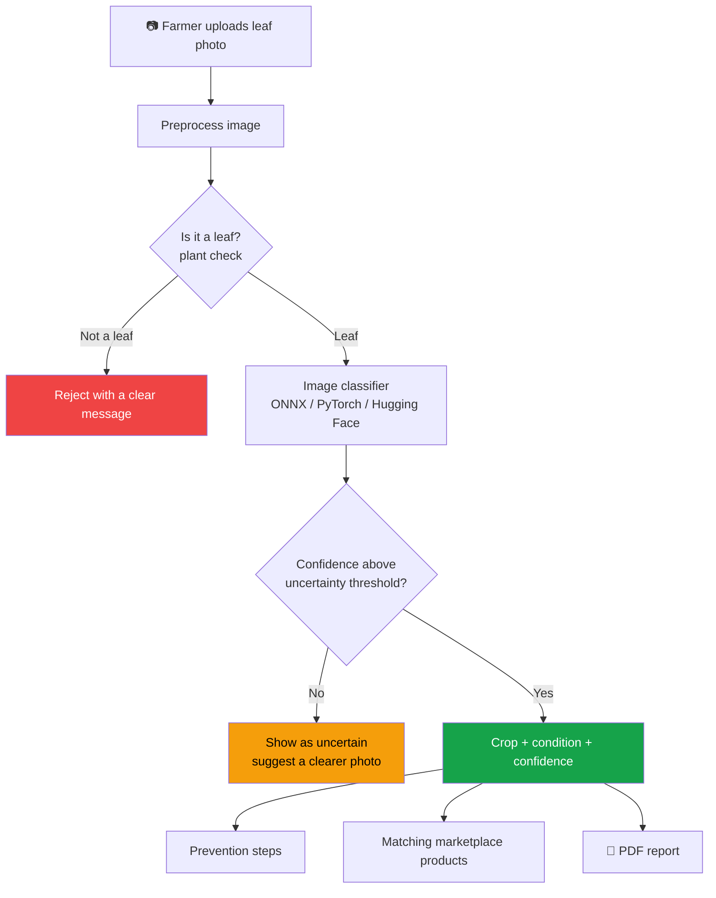
```mermaid
flowchart TD
    A["📷 Farmer uploads leaf photo"] --> B["Preprocess image"]
    B --> C{"Is it a leaf?<br/>plant check"}
    C -->|"Not a leaf"| X["Reject with a clear message"]
    C -->|"Leaf"| D["Image classifier<br/>ONNX / PyTorch / Hugging Face"]
    D --> E{"Confidence above<br/>uncertainty threshold?"}
    E -->|"No"| U["Show as uncertain<br/>suggest a clearer photo"]
    E -->|"Yes"| R["Crop + condition + confidence"]
    R --> P["Prevention steps"]
    R --> M["Matching marketplace products"]
    R --> PDF["📄 PDF report"]

    style X fill:#ef4444,color:#fff
    style U fill:#f59e0b,color:#000
    style R fill:#16a34a,color:#fff
```

### Yield prediction

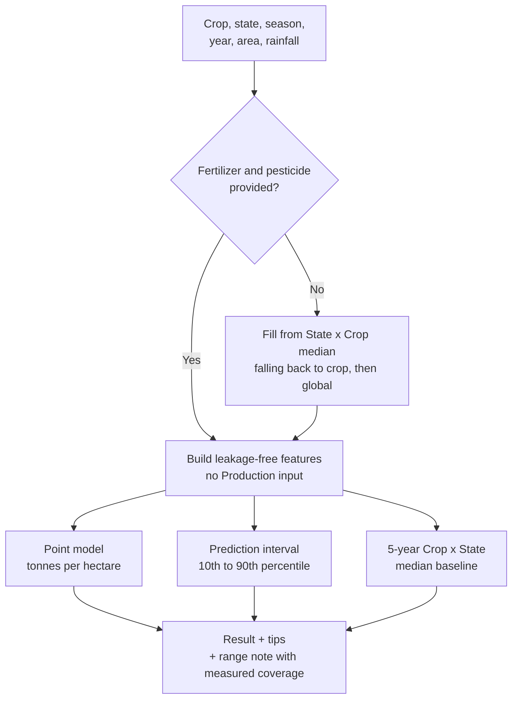
```mermaid
flowchart TD
    A["Crop, state, season,<br/>year, area, rainfall"] --> B{"Fertilizer and pesticide<br/>provided?"}
    B -->|"No"| C["Fill from State x Crop median<br/>falling back to crop, then global"]
    B -->|"Yes"| D["Build leakage-free features<br/>no Production input"]
    C --> D
    D --> E["Point model<br/>tonnes per hectare"]
    D --> F["Prediction interval<br/>10th to 90th percentile"]
    D --> G["5-year Crop x State<br/>median baseline"]
    E --> H["Result + tips<br/>+ range note with measured coverage"]
    F --> H
    G --> H
```

### Assistant (brain with fallback)

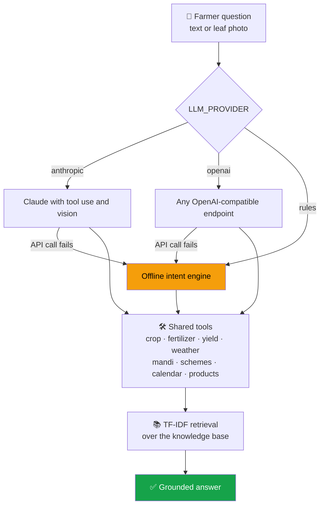
```mermaid
flowchart TD
    Q["💬 Farmer question<br/>text or leaf photo"] --> S{"LLM_PROVIDER"}
    S -->|"anthropic"| A["Claude with tool use and vision"]
    S -->|"openai"| O["Any OpenAI-compatible endpoint"]
    S -->|"rules"| R["Offline intent engine"]
    A -->|"API call fails"| R
    O -->|"API call fails"| R

    A --> T["🛠️ Shared tools<br/>crop · fertilizer · yield · weather<br/>mandi · schemes · calendar · products"]
    O --> T
    R --> T
    T --> K["📚 TF-IDF retrieval<br/>over the knowledge base"]
    K --> ANS["✅ Grounded answer"]

    style R fill:#f59e0b,color:#000
    style ANS fill:#16a34a,color:#fff
```

### Order flow

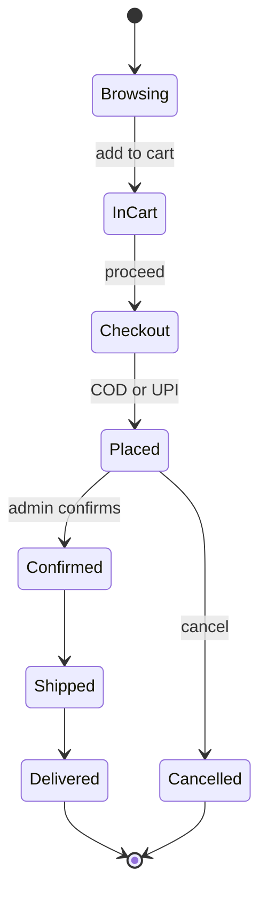
```mermaid
stateDiagram-v2
    [*] --> Browsing
    Browsing --> InCart: add to cart
    InCart --> Checkout: proceed
    Checkout --> Placed: COD or UPI
    Placed --> Confirmed: admin confirms
    Confirmed --> Shipped
    Shipped --> Delivered
    Placed --> Cancelled: cancel
    Delivered --> [*]
    Cancelled --> [*]
```

> Order status names above show the typical lifecycle. See `kisanconnect/models.py` for the exact statuses used.

---

## 🗄️ Database Design

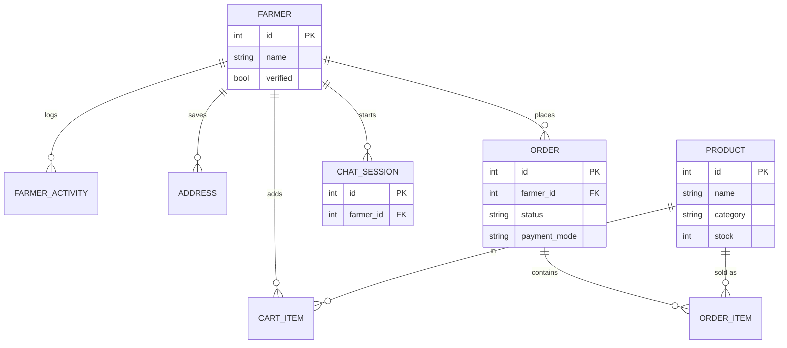
```mermaid
erDiagram
    FARMER ||--o{ FARMER_ACTIVITY : "logs"
    FARMER ||--o{ ADDRESS : "saves"
    FARMER ||--o{ CART_ITEM : "adds"
    FARMER ||--o{ ORDER : "places"
    FARMER ||--o{ CHAT_SESSION : "starts"
    PRODUCT ||--o{ CART_ITEM : "in"
    ORDER ||--o{ ORDER_ITEM : "contains"
    PRODUCT ||--o{ ORDER_ITEM : "sold as"

    FARMER {
        int id PK
        string name
        bool verified
    }
    PRODUCT {
        int id PK
        string name
        string category
        int stock
    }
    ORDER {
        int id PK
        int farmer_id FK
        string status
        string payment_mode
    }
    CHAT_SESSION {
        int id PK
        int farmer_id FK
    }
```

> Simplified view of the main entities. The exact tables and columns are in `kisanconnect/models.py`.

---

## 📦 What's Inside

| Area | What it does | Where |
|---|---|---|
| Crop recommendation | 22 crops from N, P, K, temperature, humidity, pH, rainfall; top-3 with probabilities, indicative economics, cultivation guide, PDF report | `/crop_recommendation` |
| Fertilizer recommendation | Urea / DAP / complex grades from soil and crop type, plus a kg-and-bags dose calculator with split schedule | `/fertilizer_recommendation`, `/tools/fertilizer-calculator` |
| Disease detection | Upload a leaf photo, get crop + condition, confidence, prevention steps, matching products, PDF report | `/crop_detection` |
| Yield prediction | Tonnes/ha for many crops, states and seasons, with a prediction interval | `/crop_yield` |
| Weather | 7-day forecast, soil moisture, rule-based agro-advisories via Open-Meteo | `/weather` |
| Mandi prices | Live Agmarknet prices from data.gov.in with MSP fallback | `/mandi` |
| Schemes and calendar | 16 central schemes, sowing/harvest calendar, crop guides, pest management | `/schemes`, `/crop-calendar`, `/crop-guide/<crop>` |
| Marketplace | Seeded products (fertilizers, fungicides, insecticides, seeds, organics, tools), cart, checkout, order tracking | `/marketplace` |
| Assistant | Chat with tool use over every service above, leaf photo analysis, Hindi/Hinglish | `/chat` and the floating widget |
| Admin | Farmer verification, orders, catalogue, activity audit, chat logs, labelling queue | `/admin_dashboard` |
| JSON API | Everything above for apps, SMS and WhatsApp gateways | `/api/v1/...` (see `/about`) |

---
### Disease detection (original field model)

| Version | Images / classes | Field test | Top-1 | Top-3 |
|---|---|---|---|---|
| v1 | 13,858 / 54 | 1,650 photos | 95.6% | 99.3% |
| v2 | 21,710 / 60 | 2,828 photos | 94.3% | 98.8% |

The original model was trained only on field photographs of crops Indian farmers grow, and PlantVillage lab photos were excluded from training and evaluation.

### Tabular models

| Task | Headline | Note |
|---|---|---|
| Yield | Baseline MAE **1.10 t/ha**, R² 0.66 on a time split (fit up to 2016, test 2017-2020) | No trained model beat the 5-year Crop x State median, so the median baseline ships |
| Crop recommendation | 99.3% hold-out accuracy (RandomForest) | The 22 classes are near-separable in this dataset: a sanity check, not a field-accuracy claim |
| Fertilizer | Rule-first, not model-first | The classifier is only a labelled `model_hint` |

Full model cards: `models/reports/crop_card.md`, `fertilizer_card.md`, `yield_card.md`, `disease_eval.md`.

---

## 🚀 Getting Started

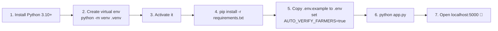
```mermaid
flowchart LR
    A["1. Install Python 3.10+"] --> B["2. Create virtual env<br/>python -m venv .venv"]
    B --> C["3. Activate it"]
    C --> D["4. pip install -r requirements.txt"]
    D --> E["5. Copy .env.example to .env<br/>set AUTO_VERIFY_FARMERS=true"]
    E --> F["6. python app.py"]
    F --> G["7. Open localhost:5000 🎉"]
```

### With pip

```bash
python -m venv .venv
.venv\Scripts\activate            # Windows   (source .venv/bin/activate on Linux/macOS)
pip install -r requirements.txt
copy .env.example .env            # Windows   (cp .env.example .env on Linux/macOS)
python app.py                     # http://localhost:5000
```

### With uv (optional)

```bash
uv sync --extra api
uv run app.py
```

### Good to know

- Default admin: `admin` / `admin123`. **Change it** with `DEFAULT_ADMIN_*` in `.env` or `flask --app app create-admin NAME PASS`.
- The database is SQLite in `instance/` by default; set `DATABASE_URL` for MySQL.
- Farmers must be verified by an admin before login. Set `AUTO_VERIFY_FARMERS=true` for demos.
- Optional warm-up (loads models once so the first request is fast): `flask --app app warmup`.
- Internet is needed for weather, mandi prices and the first-time download of the demo disease model.
- To run on a phone on the same WiFi, open the `http://<your-laptop-ip>:5000` address printed in the terminal.

---

## 🤖 The Assistant

`LLM_PROVIDER` selects the brain. All providers share the same tools (`kisanconnect/services/tools.py`) and the same TF-IDF retrieval over the knowledge base, so answers are grounded in the project's own data and models.

| Provider | Setup | Notes |
|---|---|---|
| `anthropic` | `ANTHROPIC_API_KEY` | Claude with native tool use and vision |
| `openai` | `OPENAI_API_KEY` or `OPENAI_BASE_URL` | Any OpenAI-compatible endpoint: OpenAI, Groq, OpenRouter, local Ollama / LM Studio, or Gemini's free tier |
| `rules` | nothing | Offline intent engine that still runs the ML models, weather, prices, calculator, schemes and KB search. Automatic fallback if an API call fails |

---

## 📁 Project Layout

```
app.py                      WSGI entry point (gunicorn app:app)
kisanconnect/                Flask package (internal module name)
  __init__.py               app factory, services, CLI (seed, create-admin, warmup)
  config.py                 environment-driven configuration (.env)
  models.py                 Farmer, Admin, Product, CartItem, Address, Order, ChatSession ...
  blueprints/               main, auth, farmer, marketplace, admin, chat, api
  services/                 ml, disease, knowledge, tools, llm, fallback_bot, weather, market, reports
ml/                         runtime model code: estimators, registry, taxonomy, model factory
data/                       CSV datasets + knowledge/*.json (schemes, products, guides, calendar, pests, MSP)
models/                     trained artefacts, metrics, evaluation plots and reports
templates/, static/         Bootstrap 5 UI
tests/                      pytest suite (offline; in-memory SQLite)
api/                        optional standalone FastAPI service (legacy)
docs/screenshots/           UI screenshots
```

---

## 🧪 Tests and Deployment

```bash
pytest
```

The suite runs fully offline (rules assistant, stub disease model, in-memory database).

**Deployment:** `Procfile` runs `gunicorn app:app`. Set `SECRET_KEY`, `DATABASE_URL`, `AUTO_VERIFY_FARMERS` and any API keys as environment variables. Uploads go to `static/uploads/` (`UPLOAD_DIR`).

---

## 🔭 Future Scope

- **Regional languages:** a translation layer over the assistant and reports for Hindi, Marathi, Punjabi, Gujarati, Tamil, Telugu, Kannada and Bengali.
- **Field-photo dataset:** collect consented farmer photos through the admin labelling queue to improve disease detection on more crops.
- **Own agronomy LLM:** replace the third-party assistant backend with a fine-tuned open model.
- **SMS / WhatsApp gateway:** use the existing JSON API to reach farmers without smartphones.

---


## 👥 Team

<div align="center">

### KisanConnect by Team Code Hunters 🏹

**Ujjwal Sharma**(Team Leader)

[](https://linkedin.com/in/ujjwal-sharma-934100379)
[](https://github.com/ujjwalsharma25)


*⭐ If this project helped you, consider giving it a star!*

</div>

---

